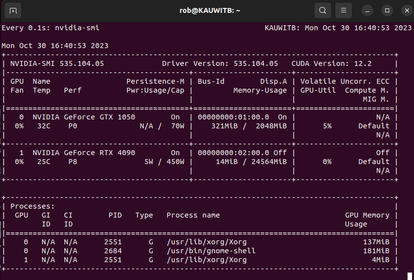

# LLaMa2_PlayGround

This will be my playground for all things using LLaMa2. 

Everything here will be run locally on an RTX 4090 Founders Edition card. (IKR!!) This card was installed to KAUWITB on Monday, October 30, 2023.

docker container start hfpt_Oct28

## Tuesday, December 19, 2023

[BGE on Hugging Face](https://python.langchain.com/docs/integrations/text_embedding/bge_huggingface) are [the best open-source embedding models](https://huggingface.co/spaces/mteb/leaderboard)

1) pip install chromadb
2) apt update
3) apt upgrade (this fired in a TON of updates! sure hope it didn't break anything!!)
4) apt install sqlite
5) pip install chromadb==0.3.29 (this version of chromadb is needed to work with sqlite)
6) pip installlark

## Monday, December 18, 2023

1) pip uninstall farm-haystack
2) pip install haystack-ai

Some important notes copied from 'YT_LangChain_Running_HuggingFace_Models_Locally.ipynb' in the Sam Witteveen folder.

* This loads the model to the CPU ... 
* model = AutoModelForCausalLM.from_pretrained(model_id)

* This works! VRAM 896 MiB
* model = AutoModelForCausalLM.from_pretrained(model_id, load_in_8bit=True)

* This works! VRAM 1780 MiB
* model = AutoModelForCausalLM.from_pretrained(model_id, device_map='cuda')

* This works! VRAM 1780 MiB
* model = AutoModelForCausalLM.from_pretrained(model_id, device_map=device)

* This loads the model to CPU.
* model = AutoModelForCausalLM.from_pretrained(model_id, torch_dtype=torch.float16)

* This DOES work! ... 896 MiB VRAM
* model = AutoModelForCausalLM.from_pretrained(model_id, load_in_8bit=True, torch_dtype=torch.float16)

## Sunday, December 17, 2023

Yesterday, I uninstalled haystack-ai, then ran 'pip install farm-haystack', and this is the version I have been using for the past 24 hours.

## Saturday, December 16, 2023

Installed 'pip install farm-haystack[inference]' this morning. Why does it downgrade transformers??

OK, so that was the wrong version of haystack to install. I uninstalled that, then ran 'pip install haystack-ai', and now the code works. 

But be aware this version of haystack is 'Haystack 2.0-Beta, an unstable version of what will eventually become Haystack 2.0' 

## Friday, December 15, 2023

[LLMDataHub: Awesome Datasets for LLM Training](https://github.com/Zjh-819/LLMDataHub)

The [E2E Cloud Blog](https://www.e2enetworks.com/blog) has many excellent posts.

Today I will start using Haystack, and I am also using Cody as my coding assistant!

## Thursday, December 14, 2023

Today I torched all hfpt images and containers, pulled down the newest 'docker pull huggingface/transformers-pytorch-gpu', built a new hfpt image, spun up a new hfpt container, and now I am working through the notebook 'quickstart_13B-HF_Test2.ipynb', and getting this to spin up. These are the packages I had to install, in the following order:

1) pip install accelerate
2) pip install bitsandbytes
3) pip install py7zr
4) pip install peft
5) pip install wandb

The default huggingface folder is now '/root/.cache/huggingface/hub'

Also, we can't run the training until we have a hugging face token in this container, so we need to login first, before running the remainder of the code. The same with wandb ...

Annddd code which worked before now fails, because of CUDA Out of Memory errors! Sigh ... 

## Tuesday, November 21, 2023

Switched to the docker container hfpt_Nov20

## Monday, November 20, 2023

Paid for OpenAI, then started running the pinecone notebooks which use openai ... damn is openai ever fast!

## Saturday, November 18, 2023

[LLaMA 2 - Every Resource you need](https://www.philschmid.de/llama-2)

Playing with the Fine_tune_Llama_2_in_Google_Colab.ipynb notebook.

Nice! So kinda just figured out playing with the max_seq_length has a dramatic affect on the memory usage duing training.

trainer = SFTTrainer(
    model=model,
    train_dataset=dataset,
    peft_config=peft_config,
    dataset_text_field="text",
    max_seq_length=max_seq_length,  <= play with this value =>
    tokenizer=tokenizer,
    args=training_arguments,
    packing=packing,
)

Gonna try this on the other notebooks that were running out of VRAM during training. 

[Supervised Fine-tuning Trainer](https://huggingface.co/docs/trl/sft_trainer)

## Friday, November 17, 2023

The quantized models from [TheBloke](https://huggingface.co/TheBloke) 
 on HuggingFace are awesome! For now, this guy is gonna be my goto for any models I want to get and play with!

 Gonna kill EVERYTHING from /home/rob/Data2/huggingface/transformers just to see how much space it frees up from the hfpt_Oct28 container. 

 Start with 265GB free on the 1TB nvme drive ... then ran ...

 rm /home/rob/Data2/huggingface/transformers 

 ... and now have 373GB free ... nice!

 Gonna focus on [Personal Copilot: Train Your Own Coding Assistant](https://huggingface.co/blog/personal-copilot) in conjunction with CodeLlama 34B ... 

 [Learning how GPT-3 instruct models were (most likely) trained](https://towardsdatascience.com/learning-how-gpt-3-instruct-models-were-most-likely-trained-3eb61e0f4169)

 "Instruction tuning is described as the task of fine-tuning a pre-trained language model (LM) to improve its ability to respond to natural language instructions. The idea is that by using supervision to teach an LM to perform tasks described via instructions, it will learn to follow instructions and do so even for unseen tasks."

 [A Beginner’s Guide to Fine-Tuning Mistral 7B Instruct Model](https://adithyask.medium.com/a-beginners-guide-to-fine-tuning-mistral-7b-instruct-model-0f39647b20fe)

 Dang! I ran out of VRAM trying to do the above. I think I need to find an example notebook of fine-tuning some 3B LLama model ... um no cuz 7B IS the smallest model!

 Nice! Ok, got the Mistral/mistral-finetune.ipynb notebook running locally to train this model!

 [Ludwig](https://pypi.org/project/ludwig/) looks interesting.

## Saturday, November 11, 2023

Gonna pivot somewhat to dive into langchain. Creating a LangChain folder for these resources.

## Thursday, November 9, 2023

More notebooks run today. 

Tomorrow I want to work on the StructuredLLama.ipynb notebook.

## Wednesday, November 8, 2023

Continuing to work through the PEFT examples found at [HuggingFace Parameter Efficient Fine Tuning](https://huggingface.co/docs/peft/index)

I've been trying to work through [Comparing the Performance of LLMs: A Deep Dive into Roberta, Llama 2, and Mistral for Disaster Tweets Analysis with Lora](https://huggingface.co/blog/Lora-for-sequence-classification-with-Roberta-Llama-Mistral) with some success ... meh for now.

## Tuesday, November 7, 2023

10:14am ran another test run of 'meta-llama/Llama-2-13b-hf'.

Now, on a slightly different path, I want to try messing with [Mistral](https://docs.mistral.ai/quickstart/)

11:23am Got the classifier.ipynb notebook to run! Nice!

3:16pm This repo is evolving into an exploration of fine tuning large language models locally on the 4090. I am beginning to further explore [HuggingFace Parameter Efficient Fine Tuning](https://huggingface.co/docs/peft/index) to better understand what it is, how it works and how to use it.

## Monday, November 6, 2023

Nice! Got that quickstart.ipynb to run!

1:35pm Running quickstart.ipynb using the 'meta-llama/Llama-2-13b-hf' model places a huge load on the 4090. 23,734MiB of VRAM, typically training within the 98% threshold ... damn!

## Sunday, November 5, 2023

5:00am Continuing to mess around with LLama ...

## Saturday, November 4, 2023

Moved the docker images and containers folder from /home/rob/Data3/docker-data to /home/rob/Data2/docker-data ... and now disk io is just as fast as it was before. Nice! ... on /home/rob/Data3/docker-data it was much slower ... 

9:41am Pulling down 'mistralai/Mistral-7B-v0.1' because they claim to be more accurate than llama2 13b ...

[MISTRALAI_](https://mistral.ai/)

3:56pm ran a few simple tests of Mistral ...

4:31pm The QuickStart.ipynb notebook from the [FaceBook LLama Recipies](https://github.com/facebookresearch/llama-recipes/tree/main) repo cannot run by itself, it has to be run from the repo. So I am going to run this notebook from the downloaded repo, then will provide some updates to what happened here, mkay? ... ;)

## Friday, November 3, 2023

6:33am CodeHammer.ipynb Ensuring all 4 LLaMa2 huggingface models are downloaded and able to load from this container.

6:51am 'Llama 2 on a Budget.ipynb'

Damn! The above article points to a Llama 2 recipies from FaceBook Research repo found [here](https://github.com/facebookresearch/llama-recipes/tree/main). This repo contains a series of demo apps that 'show how to run Llama 2 locally and in the cloud to chat about data (PDF, DB, or live) and generate video summary.'

And for sure, I will be pulling resources from this repo into this repo to keep things in one location.

7:25am gonna bail on that 'Llama 2 on a Budget.ipynb' cuz it's paywalled and pivot to the Llama 2 recipies.

9:24am OK ... I have backed up all 4 working llama2 hf models into /home/rob/Data3/huggingface/transformers. To free up some space on that hfpt_Oct28 container, I am going to whack the 2 smaller 7b models plus the 14b non-chat model, and also kill the hfpt_Oct30 container. Then I will dry to duplicate the hfpt_Oct28 container into the hfpt_llama2 container ... brb ...

10:21am ... copied everything from /var/lib/docker to /home/rob/Data3/docker-data ...

    sudo rsync -avP /var/lib/docker /home/rob/Data3/docker-data

	sent 228,688,547,337 bytes  received 19,776,929 bytes  378,342,968.18 bytes/sec
	total size is 228,559,781,351  speedup is 1.00

Damn that was a lot of data! Spun docker back up WITHOUT changing the default location, and at the least, the hfpt_Oct28 container still works! Nice! So now will change the docker default location to /home/rob/Data3/docker-data and see if it works.

11:03am Nope! New location does not work ... sigh ... gonna whack everything currently in /home/rob/Data3/docker-data ... this drive is currently at 119gb free ... gonna run ...

sudo rm -rf /home/rob/Data3/docker-data 

Wow ... now its at 350gb free! Damn!

And once again docker spins up just fine, which is good, but yeah, I want to get this to work! Primary drive is still at 86gb free.

11:48am Gonna try [these](https://docs.docker.com/config/daemon/) directions ... they are similar to what [chatgpt](https://chat.openai.com/c/28f160f1-f1a0-4e5d-ae16-54225479b6e1) suggests and different from [this](https://linuxconfig.org/how-to-move-docker-s-default-var-lib-docker-to-another-directory-on-ubuntu-debian-linux) article which did not work for me.

///////////////////////

5:31pm So tried everything again but using the instructions found at [Docker daemon configuration overview](https://docs.docker.com/config/daemon/) and this DOES work! Great!

